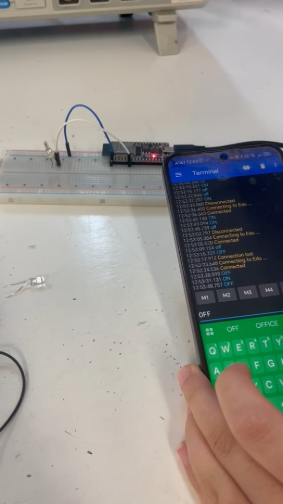

# Bitácora Universitaria: Ingeniería Mecatrónica

**Autora:** Carmen Leyva López  
**Asignatura:** Introducción a la Mecatrónica  
**Periodo:** Agosto – Septiembre 2026

---

## Resumen

> **¡Saludos! Soy Carmen.**
> Decidí estudiar Ingeniería Mecatrónica por mi fascinación por los autómatas y los pequeños mecanismos que dan vida a objetos cotidianos, como los que encuentras dentro de una cafetera.
>
> Mi intención con esta bitácora es documentar los avances, retos y aprendizajes obtenidos a lo largo de la carrera.


---

## 1.1 Inicialización del repositorio y publicación en GitHub

Para registrar la bitácora en Git por primera vez y vincularla con GitHub desde Visual Studio Code (`Terminal > Nueva terminal`), se llevan a cabo los siguientes pasos:

---

### 1. Inicializar el repositorio local

```bash
git init
```

---

### 2. Cambiar la rama principal a `main`

```bash
git branch -M main
```

---

### 3. Preparar todos los archivos

```bash
git add .
```

---

### 4. Guardar el primer commit

```bash
git commit -m "Primera versión de la bitácora universitaria"
```

---

### 5. Subir los archivos por primera vez a GitHub

```bash
git push -u origin main
```

---

> **Nota:**  
> Antes de ejecutar el paso 5, asegúrate de haber creado el repositorio remoto en GitHub y de haberlo vinculado con:
>
> ```bash
> git remote add origin https://github.com/tu-usuario/tu-repositorio.git
> ```

## 1. Sesión 2: Intermitencia y Capacitores

| Campo | Detalle |
| :--- | :--- |
| **Fecha** | 28 de agosto del 2026 |
| **Autora** | Carmen Leyva López |
| **Asignatura** | Introducción a la mecatrónica |

### 1.1 Descripción

Durante esta sesión, ensamblamos el circuito basándonos en el esquema de conexión del LM3909. Evaluamos cómo la variación en voltaje afecta directamente el tiempo de parpadeo y, por consiguiente, la intensidad de luz del led.

### 1.2 Evidencia audiovisual

[Video 1: Funcionamiento del circuito parpadeante](https://www.youtube.com/embed/1JN5oAWgr-M)

### 1.3 Evidencia fotográfica


*Figura 1. Montaje en protoboard y LED parpadeando.*

---

## 2. Sesión 3: Conexión inalámbrica y microcontrolador ESP32

| Campo | Detalle |
| :--- | :--- |
| **Fecha** | 4 de septiembre del 2026 |
| **Autora** | Carmen Leyva López |
| **Asignatura** | Introducción a la mecatrónica |

### 2.1 Descripción

Usamos el microcontrolador ESP32 para programar la intermitencia de unos leds y probar el monitor serial mediante un botón. Al final logramos conectarlo vía Bluetooth a nuestro celular y mandar directamente la señal de encendido y apagado sin necesidad de ningún botón.

### 2.2 Evidencia audiovisual

[Video 2: Demostración de conexión inalámbrica y control por Bluetooth](https://www.youtube.com/embed/1JN5oAWgr-M)

### 2.3 Evidencia fotográfica




*Figura 2. Montaje en protoboard y LED parpadeando.*

---

## 3. Sesión 4: Motor DC y Servo

| Campo | Detalle |
| :--- | :--- |
| **Fecha** | 11 de septiembre del 2026 |
| **Autora** | Carmen Leyva López |
| **Asignatura** | Introducción a la mecatrónica |

### 3.1 Descripción

Los motores de DC son dispositivos que generan movimiento mecánico mediante la interacción de campos magnéticos. Durante la sesión vimos que estos dispositivos consumen una gran cantidad de corriente, por lo que para proporcionarles suficiente y controlarlos mediante un microcontrolador se necesitan un relé o transistores y un chip L2930, este último para invertir la rotación como queramos, utilizando el código.

### 3.2 Evidencia fotográfica


*Figura 3. Montaje del motor DC en protoboard.*