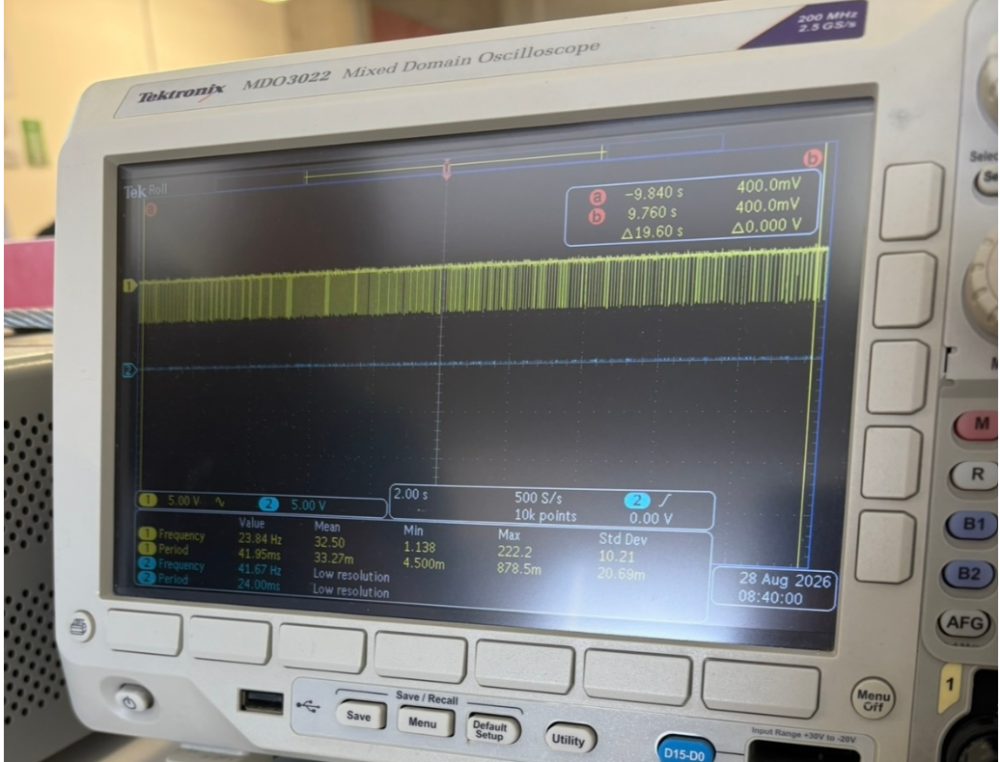
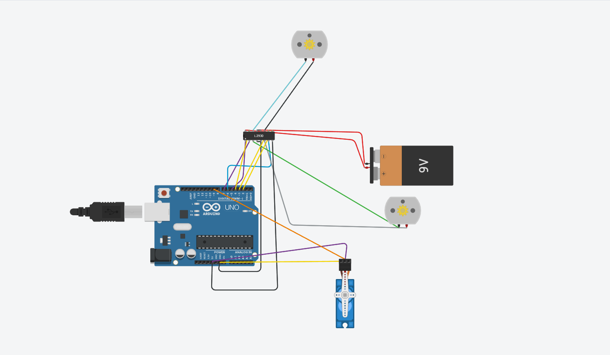
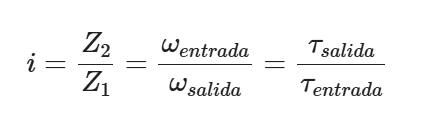
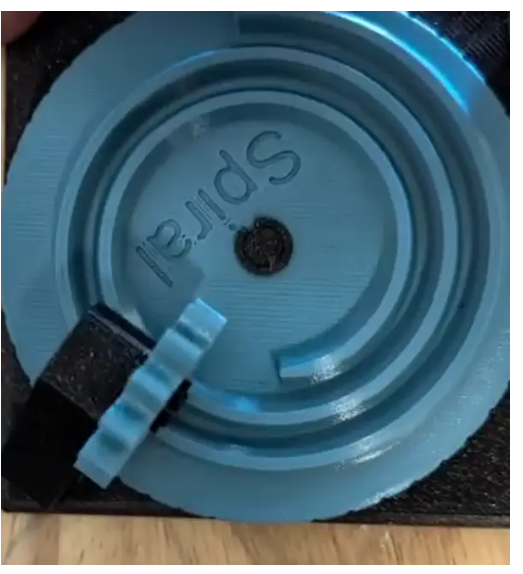

# Bitácora Universitaria: Ingeniería Mecatrónica

**Autora:** Carmen Leyva López  
**Asignatura:** Introducción a la Mecatrónica  
**Periodo:** Agosto – Septiembre 2026

---

## Resumen

> **¡Saludos! Soy Carmen.**
> Decidí estudiar Ingeniería Mecatrónica por mi fascinación por los autómatas y los pequeños mecanismos que dan vida a objetos cotidianos, como los que encuentras dentro de una cafetera.
>
> Mi intención con esta bitácora es documentar los avances, retos y aprendizajes obtenidos a lo largo de la carrera.


---

## 1.1 Inicialización del repositorio y publicación en GitHub

Para registrar la bitácora en Git por primera vez y vincularla con GitHub desde Visual Studio Code (`Terminal > Nueva terminal`), se llevan a cabo los siguientes pasos:

---

### 1. Inicializar el repositorio local

```bash
git clone
```

---

### 2. Descargar la carpeta de archivos 

```bash
ls
```

---

### 3. Preparar todos los archivos

```bash
git add .
```

---

### 4. Guardar el primer commit

```bash
git commit -m "Primera versión de la bitácora universitaria"
```

---

### 5. Subir los archivos por primera vez a GitHub

```bash
git push 
```

---

> **Nota:**  
> Antes de ejecutar el paso 5, asegúrate de haber creado el repositorio remoto en GitHub y de haberlo vinculado con:
>
> ```bash
> git remote add origin https://github.com/tu-usuario/tu-repositorio.git
> ```

## 1. Sesión 2: Intermitencia y Capacitores

| Campo | Detalle |
| :--- | :--- |
| **Fecha** | 28 de agosto del 2026 |
| **Autora** | Carmen Leyva López |
| **Asignatura** | Introducción a la mecatrónica |

### 1.1 Descripción

Durante esta sesión, ensamblamos el circuito basándonos en el esquema de conexión del LM3909. Evaluamos cómo la variación en voltaje afecta directamente el tiempo de parpadeo y, por consiguiente, la intensidad de luz del led.

Usamos el osciloscopio para registrar el voltaje y el parpadeo del LED. La amplitud de la onda indica el voltaje aplicado, mientras que la distancia horizontal entre pulsos (periodo) permite calcular la frecuencia de parpadeo. El brillo del LED no se lee directamente en el osciloscopio, pero se puede inferir a partir de la corriente y del ciclo de trabajo: a mayor ciclo de trabajo o corriente, mayor intensidad luminosa.

Referencia visual (intervalos cortos):



### 1.3 Evidencia del ensamble


*Figura 1. Montaje en protoboard y LED parpadeando.*

---

## 2. Sesión 3: Conexión inalámbrica y microcontrolador ESP32

| Campo | Detalle |
| :--- | :--- |
| **Fecha** | 4 de septiembre del 2026 |
| **Autora** | Carmen Leyva López |
| **Asignatura** | Introducción a la mecatrónica |

### 3.2 Código utilizado

```cpp
#include <BTAddress.h>
#include <BTAdvertisedDevice.h>
#include <BTScan.h>
#include <BluetoothSerial.h>

BluetoothSerial Mi_tel;

void setup() {
  Mi_tel.begin("Edu");
  Mi_tel.setTimeout(20);
  Serial.begin(9600);
  pinMode(32,OUTPUT);
}

void loop() {
  if(Mi_tel.available()){
    String mensaje= Mi_tel.readStringUntil('\n');
    mensaje.trim();
    if(mensaje == "OFF"){
      digitalWrite(32,1);
    }
    if(mensaje == "ON"){
      digitalWrite(32,0);
    }
  }
}
```

### 3.3 Observaciones

- El nombre del dispositivo Bluetooth se define en `Mi_tel.begin("Edu")`; puede cambiarse por el que se prefiera.
- Es necesario instalar en el celular una aplicación de terminal Bluetooth (como *Serial Bluetooth Terminal*) para enviar los comandos "ON" y "OFF".
- Se recomienda verificar la conexión física del LED: si se conecta directamente al pin 32 y a tierra, la lógica será la observada en esta práctica; si se invierte la polaridad, la lógica también deberá invertirse en el código.

### 2.2 Evidencia audiovisual

[Video 1: Demostración de conexión intercalando leds](https://www.youtube.com/embed/1JN5oAWgr-M)

### 2.3 Evidencia fotográfica


*Figura 2. Montaje en protoboard*

---

## 3. Sesión 4: Motor DC y Servo

| Campo | Detalle |
| :--- | :--- |
| **Fecha** | 11 de septiembre del 2026 |
| **Autora** | Carmen Leyva López |
| **Asignatura** | Introducción a la mecatrónica |

### 3.1 Descripción

En esta sesión programamos el control de un robot con dos motores DC y un servomotor usando Arduino. Los motores DC se manejan a través de un puente H (L293D/L298N), usando los pines 6 y 7 para el primer motor y los pines 3 y 4 para el segundo. Los pines 5 y 2 se configuran como habilitadores y se colocan en `HIGH` para permitir el giro de los motores. El servomotor se conecta al pin 9 y se controla con la librería `Servo.h`.

Definimos cuatro funciones (`adelante()`, `atras()`, `der()` e `izq()`) que establecen los estados de los pines para que el robot se desplace en cada dirección. Observamos que los motores DC consumen mucha corriente, por lo que requieren una fuente externa y un puente H para invertir su rotación sin dañar el microcontrolador. También comprobamos que los nombres de las funciones `der()` e `izq()` dependen del montaje físico de los motores, por lo que conviene verificarlos antes de usarlos.

### 4.2 Código utilizado

```cpp
// Incluye la librería para controlar servomotores
#include <Servo.h>

// Crea un objeto servo llamado "eus"
Servo eus;

// Función para avanzar: ambos motores giran hacia adelante
void adelante() {
  digitalWrite(6, HIGH);
  digitalWrite(7, LOW);
  digitalWrite(3, HIGH);
  digitalWrite(4, LOW);
}

// Función para retroceder: ambos motores giran hacia atrás
void atras() {
  digitalWrite(7, HIGH);
  digitalWrite(6, LOW);
  digitalWrite(4, HIGH);
  digitalWrite(3, LOW);
}

// Función para girar a la derecha
void der() {
  digitalWrite(6, HIGH);
  digitalWrite(7, LOW);
  digitalWrite(4, HIGH);
  digitalWrite(3, LOW);
}

// Función para girar a la izquierda
void izq() {
  digitalWrite(7, HIGH);
  digitalWrite(6, LOW);
  digitalWrite(3, HIGH);
  digitalWrite(4, LOW);
}

void setup() {
  // El servo está conectado al pin 9
  eus.attach(9);

  // --- Motor 1 ---
  pinMode(6, OUTPUT);    // out1
  pinMode(7, OUTPUT);    // out2
  pinMode(5, OUTPUT);    // enable del motor 1
  digitalWrite(5, HIGH); // habilita el motor 1

  // --- Motor 2 ---
  pinMode(4, OUTPUT);    // out1
  pinMode(3, OUTPUT);    // out2
  pinMode(2, OUTPUT);    // enable del motor 2
  digitalWrite(2, HIGH); // habilita el motor 2
}

void loop() {
  // Mueve el servo a 0°, espera 1 segundo
  eus.write(0);
  delay(1000);

  // Mueve el servo a 90°, espera 1 segundo
  eus.write(90);
  delay(1000);

  // Mueve el servo a 180°, espera 1 segundo
  eus.write(180);
  delay(1000);
}
```

### 4.3 Evidencia fotográfica


*Figura 3. Aquí probamos el puente L293D y como consumia corriente con el osciloscopio*


*Figura 4. Ensamble completo de los dos motores DC y un servo.*

## 5. Sesión 5: Mecanismos 

| Campo | Detalle |
| :--- | :--- |
| **Fecha** | 18 de septiembre del 2026 |
| **Autora** | Carmen Leyva López |
| **Asignatura** | Introducción a la mecatrónica |

### 5.1 Descripción

Los motores DC giran rápido y con poca fuerza. Por eso los mecanismos permiten adaptar ese movimiento: sacrifican velocidad para ganar fuerza, o cambian el tipo de movimiento.

### 7.2 Conceptos clave

- **Palancas:** la ventaja mecánica depende de los brazos. Hay tres clases según la posición del fulcro.
- **Biela-manivela:** convierte rotación en traslación (y viceversa). La velocidad del extremo no es constante.

Fórmula:



### 5.3 Taller

Recorrimos estaciones con mecanismos impresos en 3D. En cada una movimos el mecanismo a mano, observamos y llenamos la ficha.

### Tabla:
| Estación | ¿Qué hace? | Relación *i* (más o menos) | ¿Se puede regresar o se traba? | ¿Dónde lo ves en la vida real? | ¿Para qué te sirve en el carro o en un proyecto? |
| :--- | :--- | :--- | :--- | :--- | :--- |
| **A · Diferencial** | Hace que las ruedas de un mismo eje giren a velocidades distintas al dar vuelta. | No es fija (1:1 en línea recta). | Se puede regresar (si es abierto). Si tiene bloqueo, se traba. | En el eje trasero de los coches. | En el coche, para que no patinen las llantas al girar. |
| **B · Cicloidal** | Baja muchísimo las revoluciones y te mucha fuerza. Es muy compacto. | Alta (de 1:10 para arriba). | Se traba (no se puede regresar). | En brazos de robots industriales o máquinas CNC. | Para un brazo robótico o una base que gire con precisión. |
| **C · Cardán** | Pasa el giro entre dos ejes que no están alineados (hay un ángulo entre ellos). | Casi 1:1, pero no va parejo (da tirones). | Se puede regresar. | En el tubo de transmisión de camiones o autos con tracción trasera. | Para conectar el motor a las ruedas si están en ejes separados. |
| **D · Obturador** | Abre y cierra el paso de algo (como la luz) de forma intermitente. | No aplica (se mide por tiempo). | Se puede abrir y cerrar. | En las cámaras de fotos. | Para un sistema de frenos ABS o para luces intermitentes. |
| **E1 · Engranes rectos** | Pasa velocidad y fuerza entre ejes que van en paralelo. | Ej: 20 dientes a 40 → 1:2. | Se puede regresar. | En taladros, juguetes. | Para pasar el movimiento del motor a la rueda de forma simple. |
| **E2 · Tornillo sinfín** | Hace un giro de 90° y reduce  en un solo paso. | Ej: 1 entrada a 40 dientes → 1:40. | Se traba (no se puede regresar). | En grúas o sillas de ruedas. | Para un sistema de elevación que no se caiga solo cuando apagues el motor. |

### 5.4 Evidencia 



*Figura 7. Estaciones con mecanismos impresos en 3D.*